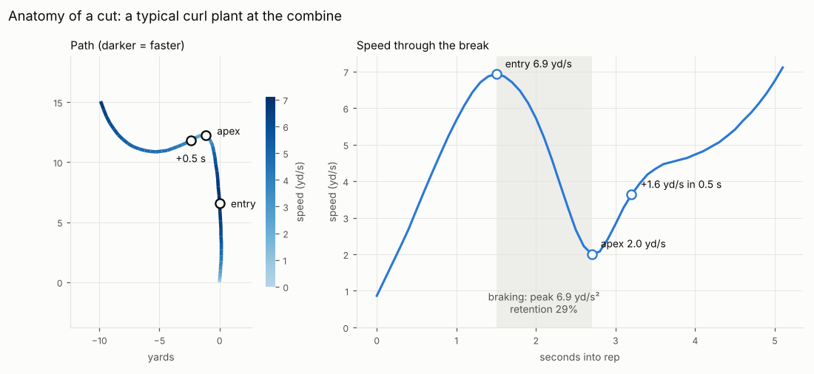
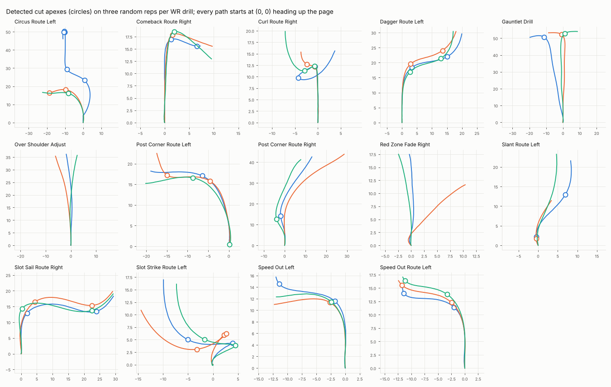

# Phase 1 — combine cut features

Generated by `notebooks/01_combine_features.py`. Do not edit by hand.

## Checks

- [x] smoothed speed matches the provided `s` — median |diff| 0.035 yd/s, 95th pct 0.20
- [x] shuttle: most reps have exactly two ≥150° reversals — 94% of 223 reps
- [x] go route: no cuts on a straight sprint — 100% of 105 reps
- [x] 3-cone: median of ≥ 4 cuts per rep
- [x] first-break direction matches the route in ≥ 90% of reps, every route — min 91%
- [x] SHORT_SHUTTLE: harder braking goes with a faster official time — r = -0.50
- [x] THREE_CONE_DRILL: harder braking goes with a faster official time — r = -0.44
- [x] pre-registered WR features have split-half reliability ≥ 0.45 — entry_speed 0.58, speed_retention 0.51, peak_lat_accel 0.53

## Method

- x/y are smoothed with a Savitzky–Golay filter (0.7 s, quadratic); velocity and acceleration come from its derivatives, split into along-track (braking / re-acceleration) and lateral (turning) parts. The same code will run on game routes in Phase 2.
- A **cut** is a peak of at least 30° in the turn between the velocity 0.5 s before and 0.5 s after a frame. Its **apex** is the slowest frame near that peak. Cuts need ≥ 2 yd/s going in and ≥ 1.5 yd/s coming out.
- Per cut: speed into the break (max over the prior 1.5 s), apex speed, speed retention (apex / entry), peak braking, distance used to slow down, peak lateral acceleration, speed regained 0.5 s after the apex.
- Each metric is z-scored within its **slot** (the same break of the same drill across players, e.g. the curl's plant). A player's feature is their mean z, so players who ran different drills are comparable.

## Cuts detected per rep

Straight-line drills (go route, over-the-shoulder, red-zone fade) should have none; the shuttle has two reversals; the 3-cone has two reversals plus three bends around cones.

| drill_name | reps | 0 | 1 | 2 | 3 | 4+ |
|---|---|---|---|---|---|---|
| CIRCUS_ROUTE_LEFT | 43 | 0 | 23 | 19 | 0 | 1 |
| COMEBACK_ROUTE_RIGHT | 110 | 0 | 63 | 44 | 2 | 1 |
| CURL_ROUTE_RIGHT | 110 | 0 | 7 | 100 | 3 | 0 |
| DAGGER_ROUTE_LEFT | 115 | 0 | 16 | 97 | 2 | 0 |
| GAUNTLET_DRILL | 200 | 0 | 199 | 1 | 0 | 0 |
| GO_ROUTE_RIGHT | 105 | 105 | 0 | 0 | 0 | 0 |
| OVER_SHOULDER_ADJUST | 101 | 98 | 3 | 0 | 0 | 0 |
| POST_CORNER_ROUTE_LEFT | 80 | 0 | 54 | 24 | 2 | 0 |
| POST_CORNER_ROUTE_RIGHT | 111 | 38 | 56 | 16 | 1 | 0 |
| RED_ZONE_FADE_RIGHT | 112 | 107 | 4 | 1 | 0 | 0 |
| SHORT_SHUTTLE | 223 | 3 | 8 | 191 | 21 | 0 |
| SLANT_ROUTE_LEFT | 110 | 8 | 73 | 29 | 0 | 0 |
| SLOT_SAIL_ROUTE_RIGHT | 106 | 1 | 23 | 81 | 0 | 1 |
| SLOT_STRIKE_ROUTE_LEFT | 102 | 0 | 0 | 95 | 7 | 0 |
| SPEED_OUT_LEFT | 37 | 0 | 27 | 10 | 0 | 0 |
| SPEED_OUT_ROUTE_LEFT | 87 | 0 | 50 | 36 | 1 | 0 |
| THREE_CONE_DRILL | 203 | 1 | 3 | 10 | 33 | 156 |

## First break direction vs route

A right-side curl breaks back inside (left), a right-side comeback breaks to the sideline (right), a left-side slant breaks inside (right), and so on. Agreement confirms the left/right sign. Reps with no detected cut count as misses.

| drill | expected first break | reps | no cut detected | share matching |
|---|---|---|---|---|
| CURL_ROUTE_RIGHT | left | 110 | 0 | 0.95 |
| COMEBACK_ROUTE_RIGHT | right | 110 | 0 | 0.99 |
| SLANT_ROUTE_LEFT | right | 110 | 8 | 0.91 |
| SPEED_OUT_ROUTE_LEFT | left | 87 | 0 | 1.00 |
| DAGGER_ROUTE_LEFT | right | 115 | 0 | 1.00 |
| SLOT_SAIL_ROUTE_RIGHT | right | 106 | 1 | 0.99 |

## WR drill slots (medians)

1,706 of 1,771 WR drill cuts fall in slots with ≥ 20 cuts. Speeds in yd/s, accelerations in yd/s².

| slot | cuts | turn_deg | entry_speed | apex_speed | retention | peak_decel | lat_accel | apex_time_s |
|---|---|---|---|---|---|---|---|---|
| CIRCUS_ROUTE_LEFT\|L1 | 43 | 46.72 | 8.23 | 7.39 | 0.92 | 1.11 | 6.64 | 3.40 |
| CIRCUS_ROUTE_LEFT\|R1 | 20 | 43.73 | 7.48 | 4.85 | 0.66 | 3.11 | 6.36 | 5.55 |
| COMEBACK_ROUTE_RIGHT\|L1 | 44 | 94.36 | 4.10 | 2.69 | 0.71 | 2.61 | 6.25 | 4.60 |
| COMEBACK_ROUTE_RIGHT\|R1 | 110 | 101.17 | 8.13 | 2.69 | 0.33 | 6.74 | 7.86 | 3.40 |
| CURL_ROUTE_RIGHT\|L1 | 104 | 117.56 | 6.93 | 1.89 | 0.27 | 7.07 | 7.57 | 2.80 |
| CURL_ROUTE_RIGHT\|R1 | 98 | 85.56 | 4.29 | 3.18 | 0.75 | 1.59 | 6.74 | 3.90 |
| DAGGER_ROUTE_LEFT\|L1 | 98 | 43.77 | 7.47 | 6.71 | 0.91 | 1.01 | 5.86 | 5.10 |
| DAGGER_ROUTE_LEFT\|R1 | 115 | 50.12 | 8.16 | 6.83 | 0.85 | 2.02 | 7.15 | 3.20 |
| GAUNTLET_DRILL\|L1 | 103 | 56.39 | 8.49 | 6.49 | 0.76 | 2.43 | 7.42 | 7.80 |
| GAUNTLET_DRILL\|R1 | 97 | 57.02 | 8.45 | 6.17 | 0.74 | 2.37 | 7.44 | 7.80 |
| POST_CORNER_ROUTE_LEFT\|L1 | 80 | 48.08 | 7.95 | 7.07 | 0.89 | 1.61 | 7.10 | 3.20 |
| POST_CORNER_ROUTE_LEFT\|R1 | 24 | 54.49 | 7.03 | 4.92 | 0.68 | 3.37 | 6.23 | 5.00 |
| POST_CORNER_ROUTE_RIGHT\|L1 | 21 | 31.56 | 6.14 | 6.10 | 1.00 | -1.84 | 4.69 | 1.70 |
| POST_CORNER_ROUTE_RIGHT\|R1 | 69 | 35.86 | 7.42 | 7.28 | 0.99 | 0.47 | 5.52 | 3.00 |
| SLANT_ROUTE_LEFT\|L1 | 29 | 33.56 | 7.49 | 7.33 | 1.00 | -0.03 | 5.19 | 3.30 |
| SLANT_ROUTE_LEFT\|R1 | 100 | 38.22 | 4.32 | 4.32 | 1.00 | -2.48 | 4.18 | 1.10 |
| SLOT_SAIL_ROUTE_RIGHT\|L1 | 82 | 47.77 | 8.23 | 6.59 | 0.81 | 1.93 | 6.54 | 5.80 |
| SLOT_SAIL_ROUTE_RIGHT\|R1 | 105 | 55.81 | 7.44 | 6.82 | 0.92 | 1.21 | 7.43 | 2.70 |
| SLOT_STRIKE_ROUTE_LEFT\|L1 | 101 | 145.27 | 5.00 | 0.90 | 0.19 | 6.91 | 7.77 | 2.70 |
| SLOT_STRIKE_ROUTE_LEFT\|R1 | 102 | 44.66 | 6.44 | 6.41 | 1.00 | -0.36 | 5.87 | 4.35 |
| SPEED_OUT_LEFT\|L1 | 37 | 56.42 | 6.98 | 6.41 | 0.92 | 1.13 | 7.49 | 2.80 |
| SPEED_OUT_ROUTE_LEFT\|L1 | 87 | 57.30 | 6.84 | 6.00 | 0.89 | 1.47 | 7.11 | 2.50 |
| SPEED_OUT_ROUTE_LEFT\|R1 | 37 | 63.47 | 6.42 | 4.18 | 0.65 | 3.22 | 6.78 | 4.20 |

## Tracking features vs official stopwatch time (Pearson r)

Negative = more of the feature goes with a faster official time. Players of all positions with both.

| drill | players | entry_speed | speed_retention | peak_decel | decel_dist | peak_lat_accel | reaccel_gain |
|---|---|---|---|---|---|---|---|
| SHORT_SHUTTLE | 159 | -0.22 | 0.08 | -0.50 | 0.03 | -0.01 | -0.42 |
| THREE_CONE_DRILL | 149 | -0.46 | -0.24 | -0.44 | 0.26 | -0.31 | -0.09 |

## Split-half reliability of WR position-drill features

107 WRs with ≥ 4 drills; median over 200 random drill splits, Spearman–Brown corrected. Roughly: < 0.3 mostly noise, 0.5 usable with shrinkage, > 0.7 solid. Left − right is confounded with drill (each route breaks a fixed way) and consistency needs repeat reps the combine doesn't have; neither measures a stable trait here.

| metric | mean | left − right | consistency (SD) |
|---|---|---|---|
| entry_speed | 0.58 | -0.04 | 0.18 |
| speed_retention | 0.51 | -0.17 | 0.25 |
| peak_decel | 0.40 | 0.08 | 0.38 |
| decel_dist | 0.23 | -0.02 | 0.00 |
| peak_lat_accel | 0.53 | -0.10 | 0.28 |
| reaccel_gain | 0.11 | -0.30 | 0.32 |

## WR features vs standard combine results (Pearson r)

107 WRs; 3-cone and shuttle times exist for only ~1/3 of them. Small |r| against the 40 means the cut features are not just straight-line speed again.

| index | forty | ten_yd_split | three_cone | short_shuttle | vertical | broad_jump | combine_weight | combine_height |
|---|---|---|---|---|---|---|---|---|
| entry_speed | -0.09 | -0.00 | -0.14 | -0.20 | -0.06 | 0.06 | -0.06 | -0.01 |
| speed_retention | -0.04 | 0.13 | -0.37 | 0.10 | 0.04 | -0.17 | 0.01 | -0.03 |
| peak_decel | 0.04 | -0.13 | 0.35 | -0.11 | 0.04 | 0.19 | -0.07 | -0.03 |
| decel_dist | -0.21 | -0.08 | 0.10 | -0.16 | -0.07 | 0.05 | -0.04 | 0.03 |
| peak_lat_accel | -0.10 | -0.07 | -0.43 | -0.23 | 0.09 | 0.04 | -0.08 | -0.18 |
| reaccel_gain | -0.02 | -0.08 | -0.02 | 0.04 | 0.13 | 0.16 | -0.12 | -0.17 |

## WR feature intercorrelations

| index | entry_speed | speed_retention | peak_decel | decel_dist | peak_lat_accel | reaccel_gain |
|---|---|---|---|---|---|---|
| entry_speed | 1.00 | -0.03 | 0.09 | 0.52 | 0.35 | -0.15 |
| speed_retention | -0.03 | 1.00 | -0.89 | -0.19 | 0.21 | -0.45 |
| peak_decel | 0.09 | -0.89 | 1.00 | 0.21 | -0.04 | 0.55 |
| decel_dist | 0.52 | -0.19 | 0.21 | 1.00 | 0.16 | -0.19 |
| peak_lat_accel | 0.35 | 0.21 | -0.04 | 0.16 | 1.00 | 0.08 |
| reaccel_gain | -0.15 | -0.45 | 0.55 | -0.19 | 0.08 | 1.00 |

## Figures

