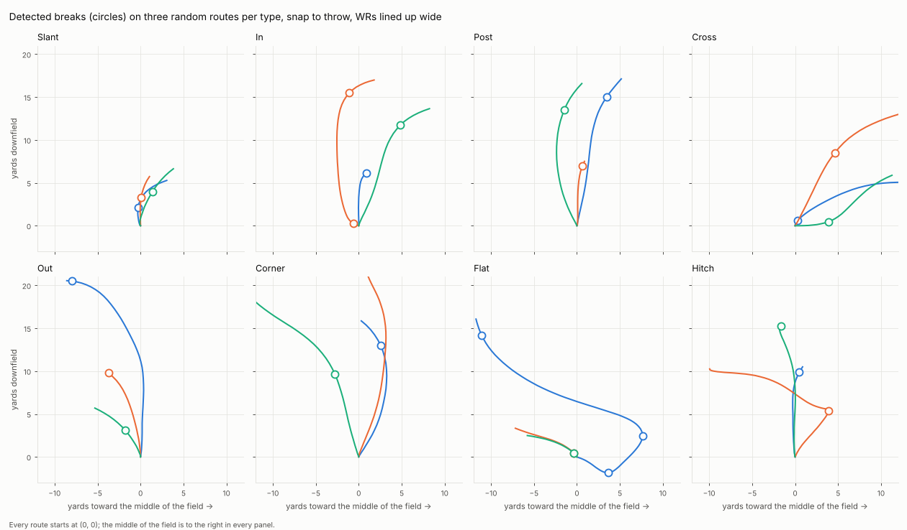

# Phase 2 — game cut features and outcomes

Generated by `notebooks/02_game_features.py`. Do not edit by hand.

## Checks

- [x] routes with two snap events are rare (< 0.1%) and dropped — 4 of 35,427 routes
- [x] ≥ 85% of WR routes have a throw and tracking — 30,955 of 35,427 (87%)
- [x] smoothed speed matches the provided `s` in game tracking — median |diff| 0.055 yd/s over 3,000 routes
- [x] first break goes the expected way (inside/outside) for ≥ 75% of each route type — slant 98%, in 88%, post 85%, cross 82%, out 91%, corner 92%, flat 79%
- [x] every route with separation has an expected separation
- [x] separation over expected averages ~0 across routes — mean +0.001 yd

## Method

- **Routes:** every regular-season route run by a player who did the WR drills at the combine. Cut features use routes with a throw; outcomes use all routes.
- **Cuts:** the Phase 1 detector (`src/cuts.py`), unchanged. A break counts if its apex falls between the snap and the throw; kinematics use 0.5 s before the snap to 1 s after the throw so breaks near either edge are measurable.
- **Features:** each metric is z-scored within its slot (route type × turn direction × order, the game version of the combine's drill slots) after a linear adjustment for the break's turn angle (as in the combine) and for play design: break depth (and its square), alignment (wide/slot/other), man vs zone coverage, and pre-snap motion. Player features average those z-scores over all seasons, and over the rookie season alone, which every draft class has exactly once.
- **Outcomes** are per-route rates. Separation over expected (SOE) compares each route with cohort routes of the same type against the same coverage family (man/zone) from the same alignment (wide/slot).
- **Qualified WRs** have ≥ 100 regular-season routes; reliability is measured on them.

## Routes by season

83 WRs ran at least one regular-season route. Routes without a throw (sacks, scrambles) count for outcomes but have no break window.

| season | all routes | with a throw and tracking |
|---|---|---|
| 2023 | 7,503 | 6,604 |
| 2024 | 12,512 | 10,914 |
| 2025 | 15,412 | 13,437 |
| total | 35,427 | 30,955 |

## Breaks detected, by route type

`with_break` is the share of routes with at least one break between the snap and the throw. Many routes are thrown before their break (often to another receiver), so the last column restricts to throws at least 0.5 s after the route type's median break time. Hitches stop rather than turn, and go routes have no designed break.

| route_ran | routes | with_break | throw_s | first_break_s | first_break_deg | with_break_if_thrown_late |
|---|---|---|---|---|---|---|
| GO | 6,076 | 0.22 | 2.60 | 1.40 | 38.18 | 0.23 |
| HITCH | 5,012 | 0.32 | 2.60 | 2.50 | 60.79 | 0.58 |
| CROSS | 3,787 | 0.41 | 3.00 | 1.50 | 38.55 | 0.42 |
| IN | 3,427 | 0.58 | 2.90 | 2.40 | 56.72 | 0.77 |
| POST | 3,123 | 0.30 | 2.90 | 2.40 | 40.85 | 0.38 |
| OUT | 2,990 | 0.70 | 2.60 | 1.80 | 52.53 | 0.73 |
| CORNER | 2,535 | 0.40 | 2.90 | 2.30 | 41.61 | 0.54 |
| SLANT | 2,105 | 0.64 | 2.10 | 1.40 | 50.53 | 0.71 |
| SCREEN | 942 | 0.17 | 1.50 | 1.30 | 59.72 | 0.24 |
| FLAT | 892 | 0.31 | 2.30 | 1.30 | 55.30 | 0.36 |
| WHEEL | 48 | 0.48 | 2.80 | 1.00 | 42.76 | 0.48 |
| ANGLE | 18 | 0.83 | 2.45 | 1.40 | 58.91 | 0.82 |

## First break direction vs route type (WRs lined up wide)

Players more than 9 yd from the field's center line, where their side of the ball is unambiguous. Slants, ins, posts and crosses should break toward the middle; outs, corners and flats toward the sideline. Agreement confirms the left/right sign on game data.

| route_ran | routes | expected | share matching |
|---|---|---|---|
| SLANT | 1,062 | inside | 0.98 |
| IN | 1,200 | inside | 0.88 |
| POST | 484 | inside | 0.85 |
| CROSS | 583 | inside | 0.82 |
| OUT | 1,092 | outside | 0.91 |
| CORNER | 451 | outside | 0.92 |
| FLAT | 70 | outside | 0.79 |

## Game slots (medians)

14,266 of 14,466 breaks fall in slots with ≥ 20 breaks. Speeds in yd/s, accelerations in yd/s², apex time in s after the snap.

| slot | cuts | players | apex_s | turn_deg | entry_speed | apex_speed | retention | lat_accel |
|---|---|---|---|---|---|---|---|---|
| OUT\|L1 | 1,189 | 77 | 1.80 | 52.16 | 5.35 | 4.76 | 0.97 | 5.83 |
| OUT\|R1 | 1,175 | 74 | 1.90 | 54.35 | 5.44 | 4.82 | 0.97 | 5.99 |
| IN\|L1 | 1,097 | 75 | 2.60 | 57.18 | 6.10 | 4.81 | 0.83 | 6.29 |
| IN\|R1 | 1,051 | 73 | 2.50 | 58.81 | 5.81 | 4.65 | 0.85 | 6.30 |
| HITCH\|R1 | 938 | 73 | 2.60 | 65.07 | 5.23 | 2.10 | 0.42 | 4.60 |
| HITCH\|L1 | 933 | 74 | 2.70 | 64.69 | 4.84 | 2.12 | 0.42 | 4.41 |
| CROSS\|R1 | 893 | 71 | 1.60 | 39.31 | 5.82 | 5.18 | 1.00 | 4.80 |
| CROSS\|L1 | 778 | 68 | 1.60 | 38.35 | 5.44 | 4.84 | 1.00 | 4.72 |
| GO\|R1 | 766 | 71 | 1.50 | 37.99 | 6.19 | 5.37 | 1.00 | 4.87 |
| SLANT\|R1 | 739 | 71 | 1.40 | 51.70 | 4.12 | 3.84 | 1.00 | 4.94 |
| GO\|L1 | 706 | 71 | 1.40 | 38.49 | 5.93 | 5.42 | 1.00 | 4.79 |
| SLANT\|L1 | 660 | 68 | 1.40 | 50.06 | 4.25 | 3.90 | 1.00 | 4.85 |
| CORNER\|R1 | 582 | 67 | 2.40 | 41.72 | 6.73 | 6.31 | 1.00 | 5.40 |
| CORNER\|L1 | 523 | 73 | 2.40 | 42.24 | 6.76 | 6.06 | 0.99 | 5.43 |
| POST\|R1 | 519 | 68 | 2.40 | 41.86 | 6.67 | 6.21 | 0.97 | 5.45 |
| POST\|L1 | 482 | 69 | 2.40 | 41.05 | 6.74 | 6.25 | 0.98 | 5.44 |
| FLAT\|R1 | 152 | 52 | 1.30 | 50.88 | 3.85 | 2.42 | 0.91 | 4.53 |
| FLAT\|L1 | 147 | 45 | 1.40 | 57.86 | 4.15 | 2.48 | 0.80 | 4.77 |
| HITCH\|R2 | 94 | 40 | 3.75 | 89.40 | 5.38 | 1.39 | 0.26 | 4.81 |
| SCREEN\|R1 | 94 | 38 | 1.40 | 56.40 | 3.26 | 1.96 | 0.49 | 3.40 |
| IN\|L2 | 90 | 40 | 3.45 | 75.57 | 5.91 | 2.43 | 0.45 | 6.56 |
| OUT\|L2 | 79 | 34 | 3.90 | 63.79 | 5.61 | 2.65 | 0.48 | 5.26 |
| OUT\|R2 | 76 | 34 | 4.00 | 60.97 | 5.52 | 2.54 | 0.51 | 5.39 |
| SCREEN\|L1 | 76 | 34 | 1.40 | 69.61 | 3.08 | 1.85 | 0.53 | 3.44 |
| IN\|R2 | 75 | 37 | 3.20 | 57.99 | 6.15 | 4.70 | 0.76 | 6.24 |
| HITCH\|L2 | 74 | 36 | 3.70 | 99.34 | 4.18 | 1.41 | 0.37 | 4.53 |
| CORNER\|R2 | 44 | 26 | 4.15 | 56.72 | 6.56 | 3.58 | 0.75 | 5.33 |
| CORNER\|L2 | 38 | 25 | 3.55 | 40.93 | 6.73 | 6.27 | 0.98 | 5.28 |
| CROSS\|R2 | 35 | 25 | 4.50 | 43.36 | 6.78 | 3.04 | 0.64 | 4.71 |
| CROSS\|L2 | 33 | 23 | 4.50 | 47.75 | 6.13 | 3.32 | 0.70 | 4.72 |
| POST\|R2 | 30 | 21 | 3.75 | 42.11 | 6.65 | 5.99 | 0.88 | 5.66 |
| POST\|L2 | 27 | 22 | 3.90 | 43.00 | 7.01 | 6.15 | 0.88 | 5.73 |
| GO\|R2 | 26 | 22 | 4.70 | 67.50 | 6.46 | 2.58 | 0.57 | 5.52 |
| SLANT\|R2 | 24 | 19 | 2.20 | 46.34 | 4.63 | 4.01 | 0.94 | 5.44 |
| SLANT\|L2 | 21 | 18 | 3.00 | 52.56 | 4.45 | 3.16 | 0.91 | 5.19 |

Raw separation averages 3.48 yd against zone and 2.12 yd against man, which is why SOE conditions on coverage.

## Split-half reliability of game cut features

63 qualified WRs with ≥ 4 games; each player's games are split at random, median over 200 splits, Spearman–Brown corrected.

| metric | median cuts | mean | left − right | consistency (SD) |
|---|---|---|---|---|
| entry_speed | 159 | 0.71 | 0.16 | 0.40 |
| speed_retention | 159 | 0.56 | 0.01 | 0.16 |
| peak_decel | 159 | 0.61 | -0.19 | 0.47 |
| decel_dist | 159 | 0.38 | -0.12 | 0.62 |
| peak_lat_accel | 159 | 0.59 | 0.39 | 0.25 |
| reaccel_gain | 159 | 0.19 | 0.02 | 0.09 |

**Game-side reliability is moderate, not high.** PLAN.md assumed the many game reps would make game features stable; with a median of 159 scored breaks per qualified WR, the pre-registered features reach entry_speed 0.71, speed_retention 0.56, peak_lat_accel 0.59. A threshold of 0.7 set before this run was not met. Breaks vary with the play call and the defense far more than combine reps do, even after the adjustments above.
The scoring (which covariates, which routes) was chosen by comparing about six variants on this reliability alone, never on outcomes or combine links, so these values are slightly optimistic.

## Outcomes for qualified WRs

63 WRs with ≥ 100 routes; reliability splits each player's games in half. Catch rate and YAC over expected rest on targets and catches only, so they are the noisiest.

| outcome | description | p25 | median | p75 | reliability |
|---|---|---|---|---|---|
| separation | separation at the throw (yd) | 2.86 | 3.03 | 3.33 | 0.86 |
| soe | separation over expected (yd) | -0.15 | 0.00 | 0.19 | 0.74 |
| tprr | targets per route run | 0.14 | 0.17 | 0.20 | 0.84 |
| yprr | receiving yards per route run | 0.92 | 1.18 | 1.54 | 0.81 |
| epa_per_route | EPA on targets, per route run | -0.02 | 0.03 | 0.05 | 0.57 |
| catch_rate | catches per target | 0.53 | 0.60 | 0.70 | 0.63 |
| yacoe | yards after catch over expected, per catch | -0.49 | 0.08 | 0.64 | 0.14 |

## Exposure by draft class

The 2025 class has one season, so few of its WRs qualify. Rookie-season features and outcomes put every class on the same footing.

| draft_year | wrs | with_routes | qualified | median_routes_qualified | median_breaks_qualified |
|---|---|---|---|---|---|
| 2023 | 39 | 32 | 29 | 707 | 283 |
| 2024 | 31 | 28 | 19 | 511 | 226 |
| 2025 | 37 | 23 | 15 | 233 | 89 |

## Figure

