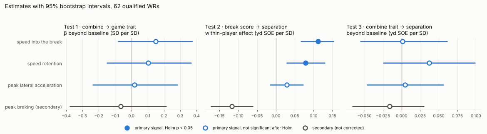

# Phase 3 — pre-registered models

Generated by `notebooks/03_models.py`. Do not edit by hand.

## Checks

- [x] 62 qualified WRs (≥ 100 regular-season routes), as pre-registered — 62
- [x] every qualified WR has all combine and game signals and SOE
- [x] reliabilities match Phase 2 (game speed into the break 0.77) — 0.775
- [x] bootstrap fits succeed (≥ 99%)
- [x] route-level sample is the pre-registered ~8,400 routes — 8,371 routes
- [x] each draft class is held out once

## Method

Exactly the plan pre-registered in PLAN.md ("Phase 3 analysis plan", commit `6d770a1`), which was committed before any combine–game or outcome link was computed. In short:

- **Sample:** the 62 qualified WRs (≥ 100 regular-season routes); classes 2023: 28, 2024: 19, 2025: 15.
- **Baseline (B):** log(draft pick) with UDFAs at pick 260 plus a UDFA flag, 40, 10-yd split, vertical, broad jump, height, weight. Missing tests filled with the sample median (5 missing 40s, 8 verticals, 7 broad jumps; 8 UDFAs).
- **Test 1:** OLS of the game trait on B + the combine trait; HC3 p, player-bootstrap CI.
- **Test 2:** route-level SOE on the route's mean break score split into within-player and player-mean parts; player-clustered p, player-cluster bootstrap CI.
- **Test 3:** OLS of player SOE on B + the combine trait; HC3 p, bootstrap CI. Out of sample: ridge, leave one draft class out, B vs B + the three primary signals.
- Holm correction within each test's 3 primary signals; 2,000 bootstrap resamples; braking and the other secondary analyses are not corrected.

## Test 1: which combine traits carry into games (translation table)

Game trait regressed on the baseline plus the combine trait, all standardized, 62 WRs. β is the SD change in the game trait per SD of the combine trait with draft pick and athletic testing held fixed. Disattenuated r = raw r / √(combine reliability × game reliability): what the raw r would be without measurement noise (descriptive, not tested). With 62 WRs a test needs an observed |r| ≥ 0.35 for 80% power.

| signal | combine reliability | game reliability | raw r | disattenuated r | beyond baseline: β (SD per SD) | 95% CI | partial r | p | Holm p | verdict |
|---|---|---|---|---|---|---|---|---|---|---|
| speed into the break | 0.58 | 0.77 | 0.17 | 0.26 | 0.15 | [-0.08, +0.37] | 0.16 | 0.248 | 0.743 | no evidence |
| speed retention | 0.51 | 0.51 | 0.083 | 0.16 | 0.10 | [-0.15, +0.37] | 0.10 | 0.478 | 0.955 | no evidence |
| peak lateral acceleration | 0.53 | 0.59 | -0.023 | -0.041 | 0.018 | [-0.24, +0.28] | 0.019 | 0.900 | 0.955 | no evidence |
| peak braking (secondary) | 0.40 | 0.40 | -0.063 | -0.16 | -0.065 | [-0.38, +0.21] | -0.062 | 0.683 |  | no evidence |

## Test 2: does the mechanic matter on the field?

8,371 routes from 62 WRs with a separation value and at least one break at or before the throw. Within-player effect: yd of separation over expected per 1 SD of the route's break score, comparing a WR's routes with each other, so the WR's role, QB and scheme cancel out. Player-mean effect: the same between WRs (confounded by those, reported only). SOE has an SD of 1.91 yd per route.

| signal | within-player effect (yd SOE per SD) | 95% CI | p | Holm p | verdict | player-mean effect (yd per SD) | player-mean p |
|---|---|---|---|---|---|---|---|
| speed into the break | 0.11 | [+0.066, +0.153] | < 0.001 | < 0.001 | matters | 0.50 | < 0.001 |
| speed retention | 0.078 | [+0.029, +0.129] | 0.004 | 0.009 | matters | -0.014 | 0.951 |
| peak lateral acceleration | 0.029 | [-0.015, +0.072] | 0.179 | 0.179 | no evidence | 0.31 | 0.121 |
| peak braking (secondary) | -0.12 | [-0.172, -0.062] | < 0.001 |  | p < 0.05 | -0.15 | 0.490 |

## Test 3: does the combine trait predict separation beyond the baseline?

Player SOE (yd, mean over each WR's routes; SD across WRs 0.25 yd) regressed on the baseline plus the combine trait (standardized).

| signal | yd SOE per SD, beyond baseline | 95% CI | partial r | p | Holm p | verdict |
|---|---|---|---|---|---|---|
| speed into the break | 0.001 | [-0.055, +0.061] | 0.007 | 0.969 | 1.000 | no evidence |
| speed retention | 0.037 | [-0.024, +0.099] | 0.19 | 0.279 | 0.837 | no evidence |
| peak lateral acceleration | 0.004 | [-0.047, +0.056] | 0.024 | 0.872 | 1.000 | no evidence |
| peak braking (secondary) | -0.016 | [-0.066, +0.030] | -0.085 | 0.532 |  | no evidence |

## Test 3, out of sample: leave one draft class out

Ridge regression (penalty chosen by generalized cross-validation inside the two training classes), predicting the held-out class's player SOE. Gain from adding the three signals: -0.027 R². Negative R² means the model predicts held-out WRs worse than their class-pooled mean would.

| model | pooled out-of-sample R² | MSE, 2023 held out | MSE, 2024 held out | MSE, 2025 held out |
|---|---|---|---|---|
| baseline | 0.41 | 0.042 | 0.030 | 0.039 |
| baseline + 3 combine cut signals | 0.38 | 0.044 | 0.032 | 0.041 |

## Exploratory (not pre-registered): what the baseline picks up in SOE

Added after the pre-registered tests ran, to explain the baseline's out-of-sample R². Weight carries it: heavier WRs are less open. SOE adjusts for route, coverage and time to throw but not alignment, so this is probably role (bigger outside receivers vs lighter slot receivers) rather than a cutting effect; that explanation is not tested here.

| baseline term | yd SOE per SD | p |
|---|---|---|
| log_pick | 0.018 | 0.499 |
| udfa | 0.025 | 0.500 |
| forty | -0.009 | 0.784 |
| ten_yd_split | -0.026 | 0.463 |
| vertical | 0.038 | 0.286 |
| broad_jump | 0.013 | 0.631 |
| height | -0.031 | 0.387 |
| weight | -0.14 | < 0.001 |

## Secondary analyses

Pre-registered as secondary: reported for context, no multiple-testing correction, no verdicts.

| analysis | signal | estimate | 95% CI | p |
|---|---|---|---|---|
| Test 3 on target rate (SD per SD) | speed into the break | 0.025 | [-0.20, +0.23] | 0.827 |
| Test 3 on target rate (SD per SD) | speed retention | -0.029 | [-0.30, +0.21] | 0.823 |
| Test 3 on target rate (SD per SD) | peak lateral acceleration | 0.23 | [-0.04, +0.49] | 0.111 |
| Test 3 on yards per route run (SD per SD) | speed into the break | 0.11 | [-0.11, +0.32] | 0.305 |
| Test 3 on yards per route run (SD per SD) | speed retention | 0.046 | [-0.21, +0.31] | 0.735 |
| Test 3 on yards per route run (SD per SD) | peak lateral acceleration | 0.18 | [-0.09, +0.45] | 0.201 |
| Test 3 on rookie-season SOE (yd per SD; 52 WRs) | speed into the break | 0.011 | [-0.049, +0.065] | 0.719 |
| Test 3 on rookie-season SOE (yd per SD; 52 WRs) | speed retention | 0.031 | [-0.056, +0.100] | 0.464 |
| Test 3 on rookie-season SOE (yd per SD; 52 WRs) | peak lateral acceleration | 0.019 | [-0.050, +0.079] | 0.608 |
| Test 2 with all kept breaks (11,841 routes) | speed into the break | 0.098 | [+0.056, +0.135] | < 0.001 |
| Test 2 with all kept breaks (11,841 routes) | speed retention | 0.039 | [-0.001, +0.081] | 0.082 |
| Test 2 with all kept breaks (11,841 routes) | peak lateral acceleration | 0.016 | [-0.023, +0.052] | 0.424 |
| Test 2, 2023 class only (28 WRs) | speed into the break | 0.14 |  | < 0.001 |
| Test 2, 2023 class only (28 WRs) | speed retention | 0.062 |  | 0.090 |
| Test 2, 2023 class only (28 WRs) | peak lateral acceleration | 0.019 |  | 0.404 |
| Test 2, 2024 class only (19 WRs) | speed into the break | 0.065 |  | 0.129 |
| Test 2, 2024 class only (19 WRs) | speed retention | 0.089 |  | 0.073 |
| Test 2, 2024 class only (19 WRs) | peak lateral acceleration | 0.030 |  | 0.555 |
| Test 2, 2025 class only (15 WRs) | speed into the break | 0.11 |  | 0.132 |
| Test 2, 2025 class only (15 WRs) | speed retention | 0.14 |  | 0.108 |
| Test 2, 2025 class only (15 WRs) | peak lateral acceleration | 0.080 |  | 0.307 |

## Figure

